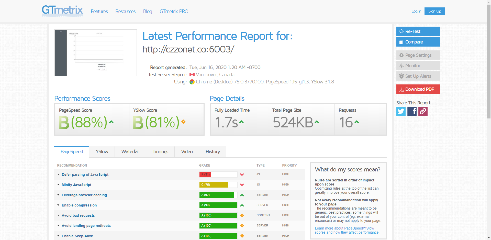

<p align="center">
  <a href="http://czzonet.co:6003">
    
  </a>
 </p>

## network-traffic-statistics-pannel-v1.0.0.200621

网络流量统计面板

## TODO

- [ ] 分布式统计
- [ ] 查询改用读取 proc 计算流量

## 演示


## 性能报告



## 特性

- 实时流量和统计
- 可视化图表面板

## 原理

启动一个服务器端口，通过原生调用系统脚本获取实时流量，每 1 秒一次，记录进数据库。前端界面通过读取数据并通过图表展示出来。

调用一次 sar 查询，会耗时 1s，得到 1 秒的总流量从而得出平均网速。解析取两列：接收速度和发送速度。

```
rxkB/s    txkB/s
```

加上时间戳就可以计算

## 技术栈

- ts 全栈
- 脚本调用
- 文件处理

## References

1. [SAR 命令的解析及使用 - 简书](https://www.jianshu.com/p/0aa4f69029e9)
