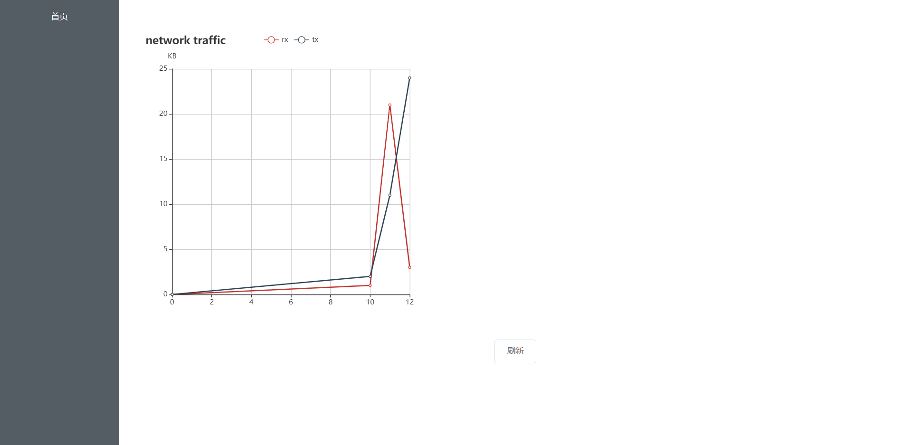

# network-traffic-statistics-pannel

网络流量统计面板

## 特性

- 实时 api 接口
- 实时流量 月度统计
- ui 面板
- 体积小于 10M 需要 node 环境

## 原理

node 启动一个服务器端口，通过原生调用系统脚本获取实时流量，每秒一次，记录进文本。前端界面通过读取数据并通过图表展示出来。

## 涉及技术栈

- node 全栈
- 脚本调用
- 文件处理

## 记录流量

每 2 秒调用一次 sar 查询，会耗时 1s，解析加入数据。取三列。

```
rxkB/s    txkB/s
```

加上时间戳就可以计算

## 查询流量

需要使用数据库

## 图表

首次加入时的样子：



## References

